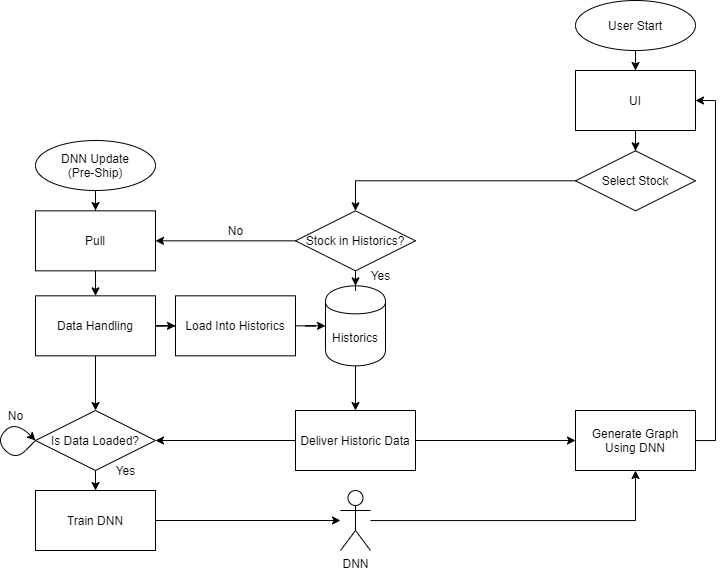
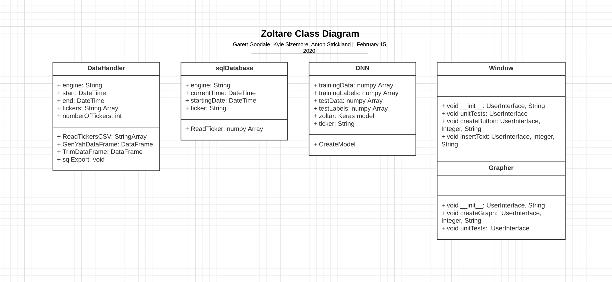
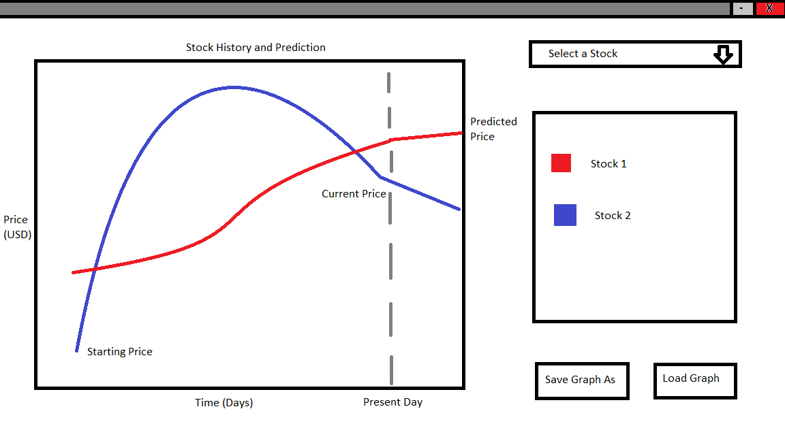

<!---Populate each section with information as it applies to your project. If a section does not apply, explain why. Include diagrams (or links to diagrams) in each section, as appropriate. For example, sketches of the user interfaces along with an explanation of how the interface components will work; ERD diagrams of the database; rough class diagrams; context diagrams showing the system boundary; etc.--->

# Program Organization

<!---
We still need some sort of diagram relating these. More than the state diagram.
-->

- DNN (Zoltar): This is Deep Neural Network that does time series forecasting on historic stock data. Since it is just a network, it can be retrained for different stocks and over different time frames and quanta.

- UI: The User Interface provides a way to interact with Zoltar and provides Visualization on the accuracy of market predictions.

- Historic’s: This is just a database with the stock data the user desires for fast display in the UI and fast training of the DNN

# Major Classes

<!---You should have an UML class diagram in this section, along with a description of each class and a table that relates each component to one or more user stories. At a minimum, you need 1 diagram of your major classes. You are encouraged to also include more detailed diagrams that include all of your classes.-->

- Data Handler: This class takes in data from a yahoo database that contains data for most major stocks.

- sqlDatabase: This class interfaces with the database to allow for simple function calls to gather full data from a stock ticker output in the desired datatype in one function call.

- DNN: This class provides functionality to easily create and train a Keras DNN based on TensorFlow.

- Window: This creates the structure and functionality for the user interface.

- Grapher: This is behind the window and provides a module for graphing functionality.

# Data Design

<!---If you are using a database, you should have a basic Entity Relationship Diagram (ERD) in this section. This diagram should describe the tables in your database and their relationship to one another (especially primary/foreign keys), including the columns within each table.--->

# Business Rules

<!---You should list the assumptions, rules, and guidelines from external sources that are impacting your program design.--->

The API's that Zoltar is built off of are free and open source when used for non-commercial purposes. Since Zoltar is not marketed or meant for profit it can utilize these API's in it's backend.

# User Interface Design

<!---You should have one or more user interface screens in this section. Each screen should be accompanied by an explaination of the screens purpose and how the user will interact with it. You should relate each screen to one another as the user transitions through the states of your application. You should also have a table that relates each window or component to the support using stories.--->

# Resource Management

Zoltar will be run locally on the user's computer. When training a neural network it will utilize as much computational power and memory as the OS will lend it while making use of any supported GPU instructions (if available) or AVX (if available). When Zoltar is not training a network it will use fairly little memory and processing power since it will primarily just be displaying data. Sufficient disk space must be available to store the desired stocks and history in the database.

# Security

Zoltar will run locally on the users computer and will not contain any personal information, so the security will be very minimal.

# Performance

The performance of Zoltar training will be enhanced when the user has a GPU or a processor that supports vector instructions such as AVX.

# Scalability

Zoltar runs locally so it is not meant for widespread scaling.

# Interoperability

# Internationalization/Localization

# Input/Output

# Error Processing

# Fault Tolerance

# Architectural Feasibility

# Overengineering

# Build-vs-Buy Decisions

<!---This section should list the third party libraries your system is using and describe what those libraries are being used for.--->

# Reuse

# Change Strategy
