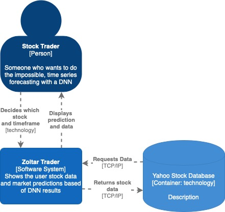
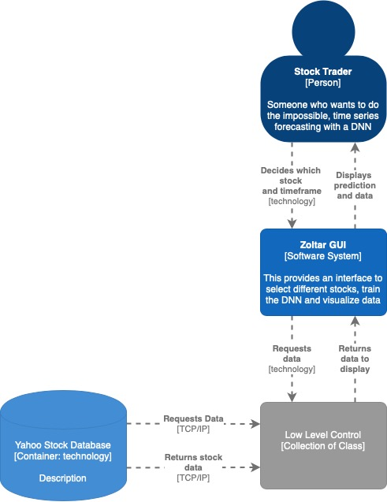
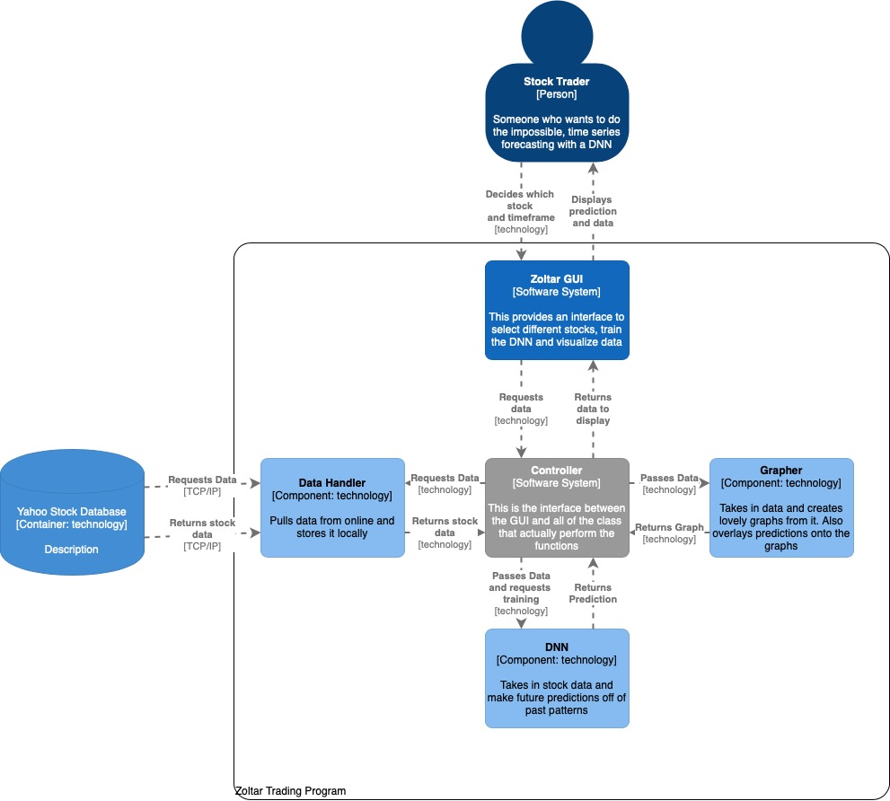
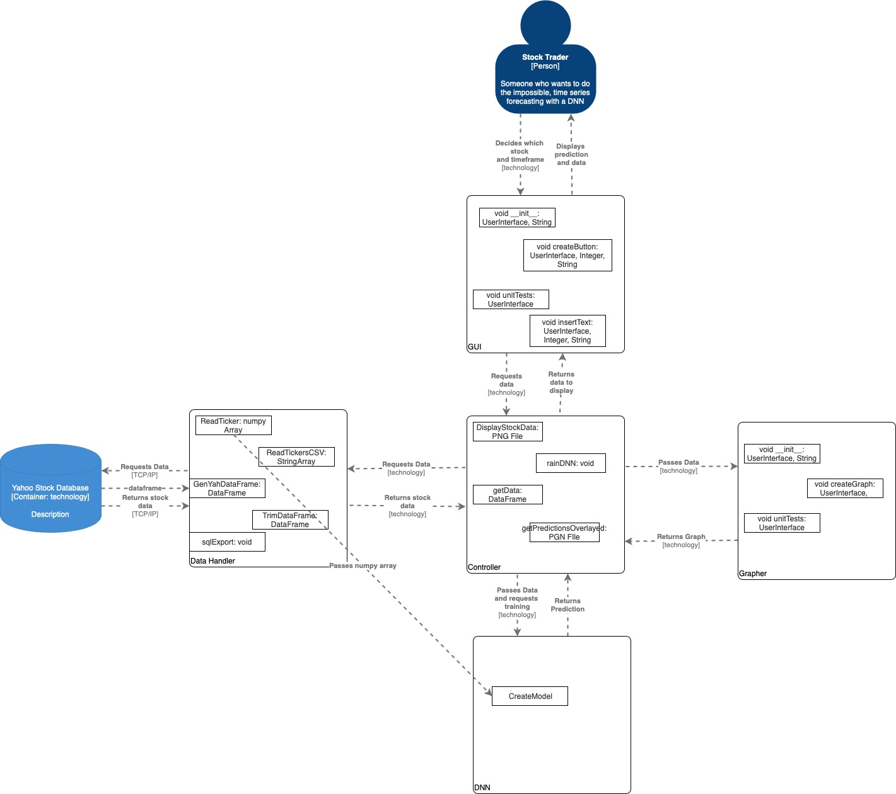
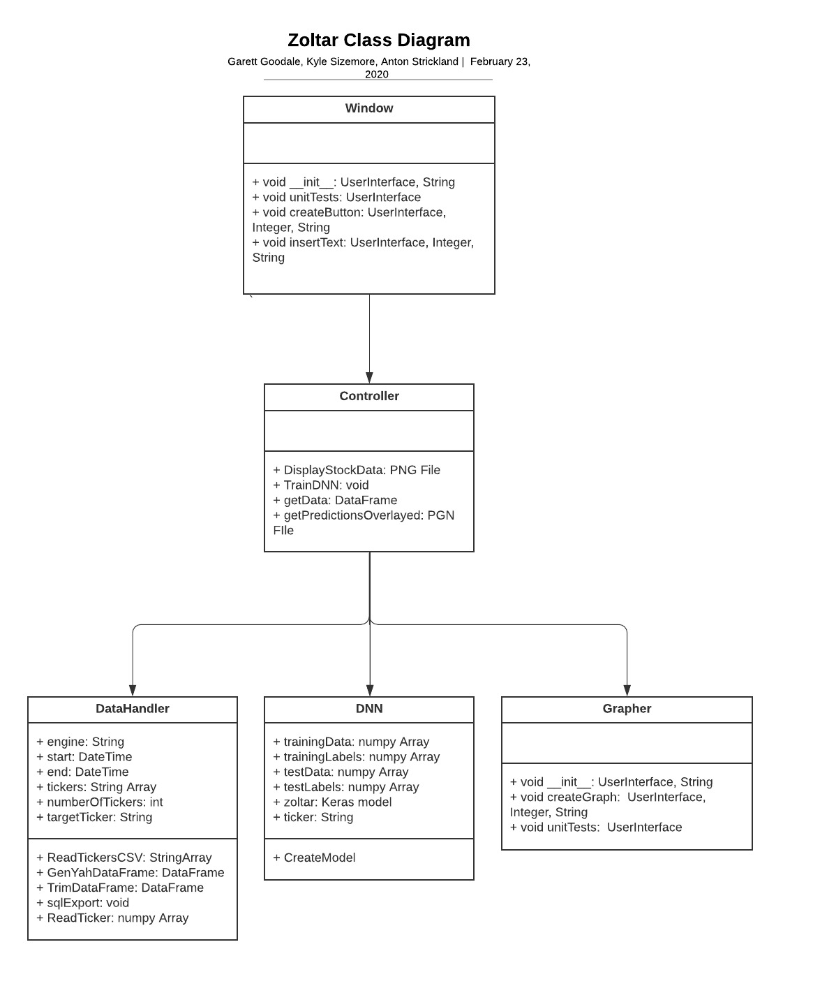
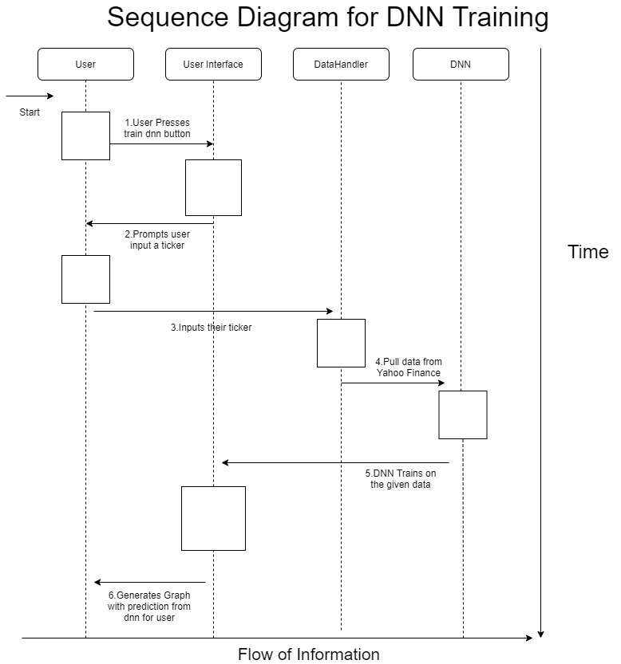
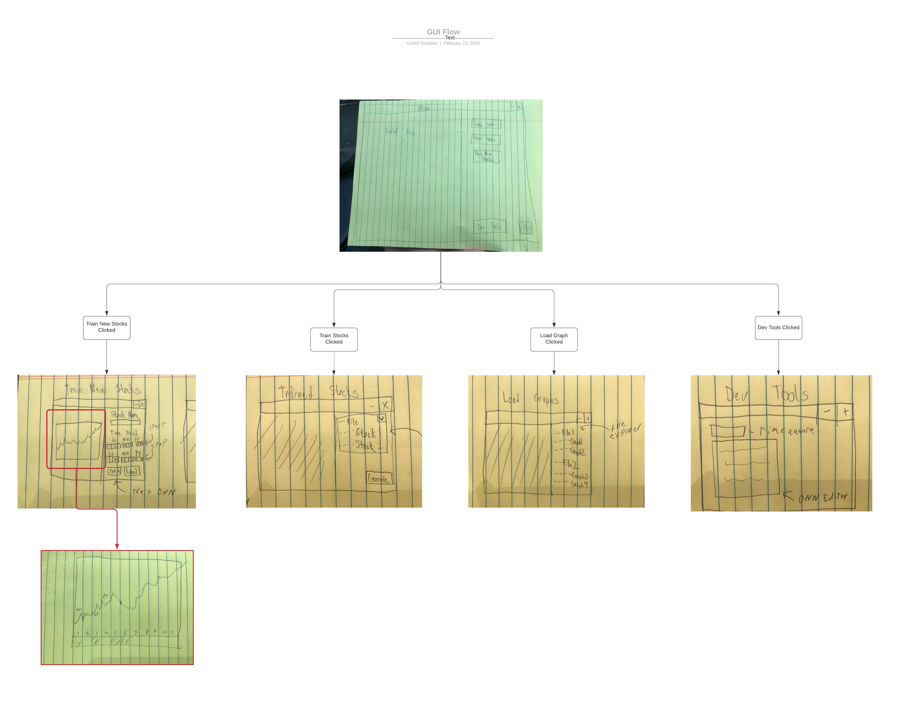

<!---Populate each section with information as it applies to your project. If a section does not apply, explain why. Include diagrams (or links to diagrams) in each section, as appropriate. For example, sketches of the user interfaces along with an explanation of how the interface components will work; ERD diagrams of the database; rough class diagrams; context diagrams showing the system boundary; etc.--->

# Program Organization

<!---
We still need some sort of diagram relating these. More than the state diagram.
-->

- DNN (Zoltar): This is Deep Neural Network that does time series forecasting on historic stock data. Since it is just a network, it can be retrained for different stocks and over different time frames and quanta.

- UI: The User Interface provides a way to interact with Zoltar and provides Visualization on the accuracy of market predictions.

- DataHandler: This is just a database with the stock data the user desires for fast display in the UI and fast training of the DNN

## Level 1
On the first level of the C4 diagram you can just see the user interacting with the Zoltar program which is just a contained program that references a single external database.

## Level 2
The second level shows that the user is interacting with a GUI and all of the lower level processing takes place below that

## Level 3
The third level shows all of our classes and the program structure. The GUI calls all of the shots and the controller interfaces with the lower level software.

## Level 4
Finally at the forth level you can see all of the classes.

## State Diagram
We added this to help users understand the flow of the program.

# Major Classes

<!---You should have an UML class diagram in this section, along with a description of each class and a table that relates each component to one or more user stories. At a minimum, you need 1 diagram of your major classes. You are encouraged to also include more detailed diagrams that include all of your classes.-->

- Data Handler: This class takes in data from a yahoo database that contains data for most major stocks.

- sqlDatabase: This class interfaces with the database to allow for simple function calls to gather full data from a stock ticker output in the desired datatype in one function call.

- DNN: This class provides functionality to easily create and train a Keras DNN based on TensorFlow.

- Window: This creates the structure and functionality for the user interface.

- Grapher: This is behind the window and provides a module for graphing functionality.

## Relationship Between Classes and User Stories

This shows what user stories are satisfied by which classes. Note that Controller satisfies most of the user stories because it interfaces with everything so really no stories would be satisfied without it.

| Class | User Stories Satisfied |
|----------------|---------------|
|     Window     |           001, 008 |
|     Controller |           001 - 017 |
|     DataHandler|           003, 006, 002 |
|            DNN |           007, 005, 015 |
|        Grapher |           017, 011 |

# Data Design

<!---If you are using a database, you should have a basic Entity Relationship Diagram (ERD) in this section. This diagram should describe the tables in your database and their relationship to one another (especially primary/foreign keys), including the columns within each table.--->

Zoltar pulls information from an external database, but does not have a database itself.

# Sequence Diagram
When the user opens the program they will start by clicking "Train DNN" this will take them to a window where they can select what stock they want to train the DNN on. At that point the program will pull the available data on that stock from Yahoo finance and allow the user to select the time frame they wish to train over. The user will then click train and the DNN will go into motion. Once the DNN is ready it will give them future predictions and show a graph of how it would have performed historically.

# Business Rules

<!---You should list the assumptions, rules, and guidelines from external sources that are impacting your program design.--->

The API's that Zoltar is built off of are free and open source when used for non-commercial purposes. Since Zoltar is not marketed or meant for profit it can utilize these API's in it's backend.

# User Interface Design

<!---You should have one or more user interface screens in this section. Each screen should be accompanied by an explaination of the screens purpose and how the user will interact with it. You should relate each screen to one another as the user transitions through the states of your application. You should also have a table that relates each window or component to the support using stories.--->

This just gives a very basic idea of what the Zoltar window will look like.

The diagram below shows the flow of the UI. As the user clicks different buttons, new frames within the window will pop up allowing the user to select the relevant option.

# Resource Management

Zoltar will be run locally on the user's computer. When training a neural network it will utilize as much computational power and memory as the OS will lend it while making use of any supported GPU instructions (if available) or AVX (if available). When Zoltar is not training a network it will use fairly little memory and processing power since it will primarily just be displaying data. Sufficient disk space must be available to store the desired stocks and history in the database.

# Security

Zoltar will run locally on the users computer and will not contain any personal information, so the security will be very minimal.

# Performance

The performance of Zoltar training will be enhanced when the user has a GPU or a processor that supports vector instructions such as AVX.

# Scalability

Zoltar runs locally so it is not meant for widespread scaling.

# Interoperability

Due to the fact that most libraries for building DNNs are best suited to be used with Python we decided to use Python as a primary language. Since Python supports all of the other functionality needed, there was no need for interoperability between any other languages.

# Internationalization/Localization

Zoltar can technically be deployed worldwide, but it will only support stocks traded in the US market and all actions and buttons will be in English. Since Zoltar is flexible it could be released in other countries at a later date if a database of the stocks on their exchanges with pricing data was available.

# Input/Output

The input for the program is both what stock the user wants to predict and the data from the stock retrieved externally.

The output is simply a graph with the historical pricing data, the DNN's performance over that time frame, and the DNN's future prediction for the time frame.

# Error Processing

Error processing will be done using try catch methods and data parsing to catch invalid inputs.

# Fault Tolerance

Zoltar will likely just display and error message and close.

# Architectural Feasibility

Since scaling is not a bit part of Zoltar the architecture is feasible for the intended use and market.

# Overengineering

There are many ways to overengineer this program. For example, the DNN can be refined in many many ways over time, by changing layers, activation functions and the input data size and time frame. However, all of the major overegineering largely stems from perfecting the DNN which will be an exercise left to advanced users. Due to time contraints, Zoltar will really be a bare minimum framework to provide more ability to expand from.

# Build-vs-Buy Decisions

We've decided to take advantage of a long list of api's afforded to us by the miniconda package (manually installed smaller version of Anaconda) for our project. Python and subsequently, Anaconda, are known for their extensive data analysis packages which just made it them a natural fit for what we are trying to accomplish with zoltar. For data handling we utilize the pymysql and sqlalchemy packages for their sql query and engine methods. We utilize Pandas for their extremely powerful dataFrame object type which is utilized in our data handling, data acquisition, and graphical interface. Numpy is used by both our DNN and GUI. The GUI utilizes tkinter, matplotlib, and seaborn to create windows and graphs. Our DNN of choice for data processing comes from the Keras package due to its ease of use.

<!---This section should list the third party libraries your system is using and describe what those libraries are being used for.--->

# Reuse

Any of the main classes for this project could be reused. The DNN could be restructured and trained on different data, the window could be adapted to display other data of interest, and the data tool could gather data from other databases. However, since this project largely takes advantage of other APIs, that code could be created fairly easily directly for it's desired application, so reuse is unlikely.

# Change Strategy

We will be following standard Agile practices.

